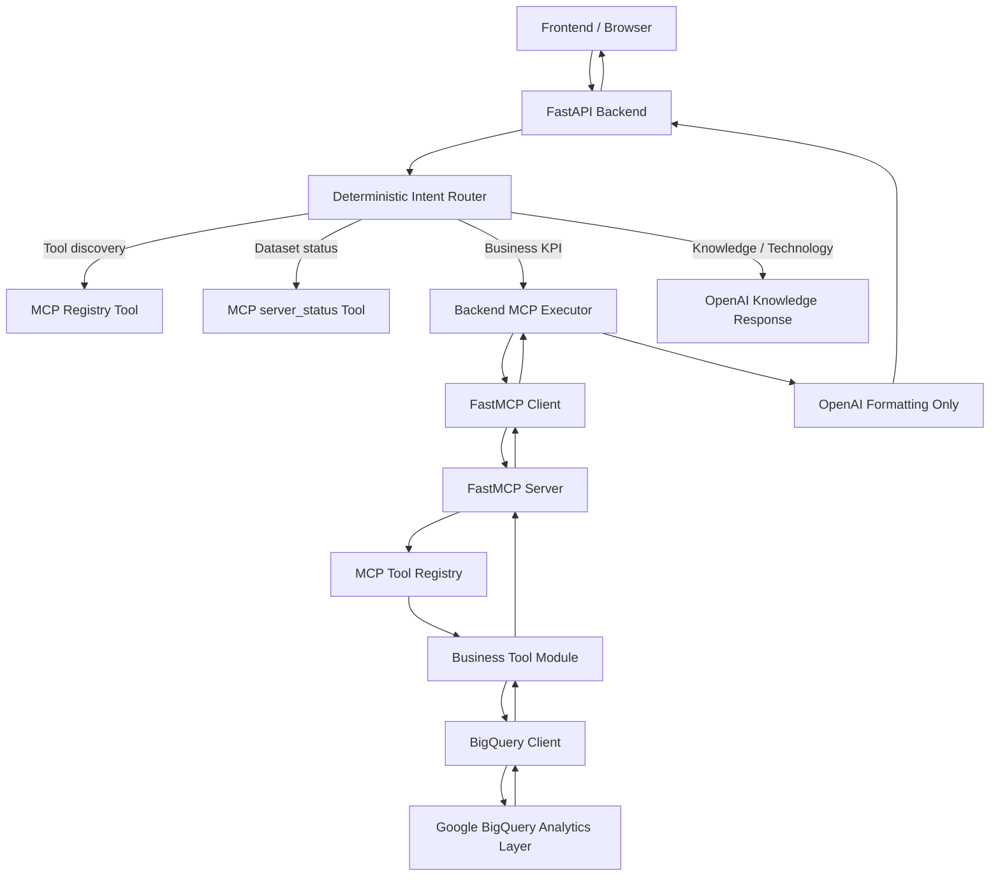

# DeTLeng AI Business Intelligence Platform
# Enterprise Architecture Audit

Audit date: 2026-07-14  
Scope: `detleng-bigquery-mcp` and `casestudy-ai-backend`  
Audit type: Architecture, code, data engineering, MCP, AI platform, and production readiness review  
Code changes made: None

---

## Section 1: Executive Summary

The DeTLeng platform is a production-style AI Business Intelligence system that connects a browser-based user experience to trusted business analytics stored in Google BigQuery. The system is split into two cooperating repositories:

- `casestudy-ai-backend`: a FastAPI AI backend that receives user questions, classifies intent deterministically, calls MCP tools when a business KPI is requested, and uses OpenAI only to explain verified results.
- `detleng-bigquery-mcp`: a FastMCP server that exposes registered Business Intelligence tools. Each tool executes a defined BigQuery analytics query and returns structured Python dictionaries or lists.

The platform has a strong architectural direction. It separates AI explanation from business metric execution, which is the right pattern for reducing hallucinations in analytics systems. The backend does not rely on the LLM to decide whether a KPI tool should run. Instead, deterministic Python routing classifies each request into one of seven intents: `BUSINESS_KPI`, `TOOL_DISCOVERY`, `DATASET_INFORMATION`, `TECHNOLOGY`, `KNOWLEDGE`, `CASE_STUDY`, and `GENERAL`.

The MCP server is modular and scalable. Business tools are split into logical modules: executive, revenue, sales, customer, product, seller, order, delivery, payment, review, geography, and time intelligence. A central `registry.py` exposes 100 registered MCP tools. The backend registry also maps 100 tool routes, so tool discovery and deterministic routing are aligned.

The BigQuery layer follows an analytics-layer-only design. The current schema contains a star-style analytical model with five dimensions and five facts:

- Dimensions: `dim_customers`, `dim_dates`, `dim_geography`, `dim_products`, `dim_sellers`
- Facts: `fact_orders`, `fact_sales`, `fact_payments`, `fact_reviews`, `fact_delivery`

The BI scope is broad for a case-study platform: executive KPIs, revenue, products, customers, sellers, orders, payments, reviews, delivery, geography, and time intelligence are represented. The architecture is suitable for demonstrating an AI + data engineering platform and can evolve into a reusable Google Cloud Data Engineering Intelligence Platform.

The project is not yet enterprise production ready. The largest gaps are security, observability, testing, multi-tenancy, API governance, deployment hardening, and formal BigQuery cost controls. CORS is open, authentication and authorization are absent, BigQuery query jobs do not enforce maximum bytes billed, and tests are mostly smoke scripts rather than automated regression suites. The backend uses synchronous FastAPI handlers with `asyncio.run`, which is workable for a small deployment but should be replaced before high concurrency.

Final CTO-level assessment: continue from this codebase, do not rebuild from scratch. The architecture already contains the hardest conceptual decisions: deterministic routing, a BI tool registry, MCP separation, analytics-layer-only access, modular tools, and OpenAI as an explanation layer rather than a source of truth. The next work should harden the platform, not replace it.

---

## Section 2: Architecture Diagram

Layer responsibilities:

- Frontend: sends chat questions to the backend and displays responses. It is outside the reviewed source but depends on the backend contract.
- FastAPI Backend: exposes `/`, `/chat`, and `/chat-v2`; loads knowledge; configures OpenAI; controls routing and response shape.
- Routing: deterministic Python logic in backend `registry.py`; classifies intent and maps KPI questions to exact MCP tool names.
- OpenAI: used for knowledge answers and for formatting verified MCP results. It should not invent business KPIs.
- MCP Client: `mcp_client.py` handles FastMCP `Client`, tool discovery, validation, timeout, retry, response extraction, and errors.
- FastMCP Server: `server.py` starts `FastMCP`, registers server status, tool discovery, and BI tools.
- Business Tools: modular Python functions that execute one SQL query each and return clean JSON-like structures.
- BigQuery: trusted analytics layer; all KPI facts come from `cs003_olist_analytics`.

---

## Section 3: Repository Review

### Repository 1: `detleng-bigquery-mcp`

Purpose: provide a custom FastMCP server that exposes business-friendly BigQuery analytics as MCP tools.

Responsibilities:

- Start the MCP server using streamable HTTP.
- Load Google Cloud and BigQuery configuration.
- Authenticate to BigQuery.
- Maintain a central MCP tool registry.
- Execute business tools by registered name.
- Keep SQL in business tool modules.
- Provide knowledge documents, query safety rules, and data model documentation.

Dependencies:

- `fastmcp==3.4.2`
- `google-cloud-bigquery`
- `google-auth`
- `python-dotenv`
- `openai` is listed but not materially used by the MCP server code.

Communication:

- Receives MCP calls from the backend via FastMCP streamable HTTP.
- Executes BigQuery queries through `google.cloud.bigquery.Client`.
- Returns structured tool results to the MCP client.

Strengths:

- Strong separation between server, registry, executor, tools, config, and BigQuery client.
- 100 registered BI tools.
- Modular tool organization.
- Uses configured project and dataset through a shared helper.
- Includes extensive business, architecture, safety, and roadmap documentation.

Weaknesses:

- No authentication on MCP endpoint.
- BigQuery client lacks query job configuration, dry-run validation, timeout, labels, and maximum bytes billed.
- Test files are smoke scripts, not automated tests.
- Documentation is extensive but partly aspirational.
- Some dependencies are unnecessary or not tightly pinned.

### Repository 2: `casestudy-ai-backend`

Purpose: provide the AI backend that receives user questions, routes them deterministically, calls the MCP server, and uses OpenAI for explanation.

Responsibilities:

- Expose HTTP endpoints to the frontend.
- Load DeTLeng knowledge base.
- Classify intent.
- Route KPI questions to MCP tools.
- Route tool discovery and dataset information directly to MCP.
- Call OpenAI for knowledge responses and verified-result explanations.
- Return frontend-compatible JSON responses.

Dependencies:

- `fastapi`
- `uvicorn`
- `openai`
- `python-dotenv`
- `pydantic`
- `fastmcp==3.4.2`

Communication:

- Frontend to backend over HTTP.
- Backend to MCP server using FastMCP client.
- Backend to OpenAI using Chat Completions API.

Strengths:

- Deterministic routing prevents many KPI hallucinations.
- Tool discovery and dataset information bypass OpenAI.
- MCP client has retry, timeout, validation, and robust result extraction.
- Detailed logging and debug router mode exist.
- External API contract is simple and stable.

Weaknesses:

- No user authentication or authorization.
- Open CORS with credentials enabled.
- Synchronous FastAPI handlers use `asyncio.run`.
- No automated route regression tests in the repository.
- Backend registry is very large and keyword-based; this will become harder to maintain at hundreds of tools.

---

## Section 4: File-by-File Review

Quality score meaning: 10 is enterprise-grade, 7 is good production-style, 5 is functional but immature, below 5 needs significant hardening.

### `detleng-bigquery-mcp`

| File | Purpose | Classes | Functions | Dependencies | Quality | Complexity | Risk | Suggestions |
|---|---|---:|---:|---|---:|---|---|---|
| `server.py` | FastMCP server startup, status, discovery, tool registration | 0 | 2 | `fastmcp`, `config`, `executor`, `registry` | 8 | Low | Medium | Add endpoint auth at deployment edge; avoid startup prints in structured logging environments. |
| `registry.py` | Central MCP registry and FastMCP wrapper builder | 0 | 4 | `tools`, `executor`, `inspect`, `functools` | 8 | Medium | Medium | Add registry metadata: category, descriptions, args, ownership, version. |
| `executor.py` | Executes tools by name and lists registered tools | 0 | 2 | `registry` | 7 | Low | Medium | Add structured error types and audit logging. |
| `bigquery_client.py` | Loads credentials and executes BigQuery SQL | 1 | 3 | `google.cloud.bigquery`, service account config | 6 | Low | High | Add query timeout, job labels, max bytes billed, retries, dry-run helper, and least-privilege validation. |
| `config.py` | Environment configuration for MCP and BigQuery | 0 | 0 | `os` | 7 | Low | Medium | Validate required envs at startup; remove unused `MODEL` or document it. |
| `requirements.txt` | MCP dependencies | 0 | 0 | FastMCP, BigQuery, OpenAI, dotenv | 6 | Low | Medium | Pin all deploy-critical dependencies; remove unused dependencies. |
| `README.md` | Project overview and vision | 0 | 0 | None | 7 | Low | Low | Keep current tool count and architecture synchronized. |
| `CHANGELOG.md` | Final hardening notes | 0 | 0 | None | 7 | Low | Low | Split backend and MCP changelogs if repositories remain separate. |
| `LICENSE` | MIT license | 0 | 0 | None | 8 | Low | Low | Fine. |
| `prompts/system_prompt.md` | AI behavior policy and tool-use rules | 0 | 0 | None | 8 | Medium | Medium | Align with backend language policy; avoid static tool list drift by referencing registry. |
| `tools/__init__.py` | Public tool exports | 0 | 0 | All tool modules | 7 | Medium | Medium | Generated registry/export tooling would reduce manual drift. |
| `tools/common.py` | Shared BigQuery client, table helper, limit, JSON conversion | 0 | 6 | `BigQueryClient`, `config`, `Decimal` | 8 | Low | Medium | Add query wrapper logging and cost metadata. |
| `tools/executive_tools.py` | Executive KPIs and summaries | 0 | 14 | `common` | 8 | Medium | Medium | Consider shared scalar-query helpers for summary functions. |
| `tools/revenue_tools.py` | Revenue analytics and growth tools | 0 | 11 | `common` | 8 | Medium | Medium | Add tests for all time joins and seller-geography assumptions. |
| `tools/sales_tools.py` | Sales aliases for product/category rankings | 0 | 4 | `common`, `revenue_tools` | 8 | Low | Low | Good reuse. |
| `tools/customer_tools.py` | Customer spend, CLV, growth, monthly/yearly customers | 0 | 8 | `common`, `executive_tools` | 8 | Medium | Medium | Clarify unique vs active customer definitions in tool metadata. |
| `tools/product_tools.py` | Product count, category, best/worst, price tools | 0 | 10 | `common`, `executive_tools` | 8 | Medium | Medium | Average product price currently uses sales value; document or refine later. |
| `tools/seller_tools.py` | Seller count, revenue, growth, average revenue | 0 | 6 | `common`, `executive_tools`, `geography_tools`, `revenue_tools` | 8 | Medium | Medium | Watch circular import risk through geography/revenue reuse. |
| `tools/order_tools.py` | Order status and time distribution tools | 0 | 10 | `common` | 8 | Medium | Medium | The helper `get_orders_by_status` is internal but named like a public tool; document as private or rename later. |
| `tools/delivery_tools.py` | Delivery performance KPIs | 0 | 6 | `common` | 8 | Low | Medium | Ensure delivery flags are integer and non-null in data quality checks. |
| `tools/payment_tools.py` | Payment values, installments, payment distributions | 0 | 6 | `common` | 8 | Low | Medium | Confirm semantic difference between payment value and revenue in docs. |
| `tools/review_tools.py` | Ratings, review distribution, sentiment-like review metrics | 0 | 8 | `common` | 8 | Medium | Medium | Review-to-product joins through order sales can duplicate reviews for multi-item orders; document accepted grain. |
| `tools/geography_tools.py` | Customer/seller density and geography counts | 0 | 7 | `common`, `revenue_tools` | 8 | Low | Medium | Distinguish customer geography vs seller geography in registry metadata. |
| `tools/time_tools.py` | Monthly, quarterly, yearly, growth, time trends | 0 | 11 | `common` | 8 | Medium | Medium | Add tests for date joins and gap periods. |
| `test_bigquery.py` | Manual BigQuery connection smoke test | 0 | 0 | `BigQueryClient` | 4 | Low | Medium | Convert to pytest with assertions and credential skipping. |
| `test_client.py` | Manual FastMCP client smoke test | 0 | 1 | `fastmcp.Client`, `asyncio` | 4 | Low | Medium | Convert to automated integration test. |
| `test_tools.py` | Manual direct tool smoke test | 0 | 0 | `tools` | 4 | Low | Medium | Convert to unit tests with mocked BigQuery rows. |
| `docs/01-architecture.md` | Architecture narrative | 0 | 0 | None | 8 | Low | Low | Keep diagrams current with backend deterministic router. |
| `docs/02-business-tools.md` | Business tool philosophy and categories | 0 | 0 | None | 8 | Low | Low | Add generated registry table. |
| `docs/03-security.md` | Security target-state documentation | 0 | 0 | None | 7 | Low | Medium | Separate current-state from future-state controls. |
| `docs/04-data-flow.md` | Data flow explanation | 0 | 0 | None | 8 | Low | Low | Update to emphasize Python routing before OpenAI. |
| `docs/05-development-roadmap.md` | Roadmap | 0 | 0 | None | 7 | Low | Low | Add release criteria per phase. |
| `docs/06-deployment-guide.md` | Deployment guide | 0 | 0 | None | 7 | Low | Medium | Add Render-specific operational runbook. |
| `docs/07-api-reference.md` | API/tool reference | 0 | 0 | None | 7 | Low | Low | Auto-generate from registry to avoid drift. |
| `docs/08-contributing.md` | Contribution guide | 0 | 0 | None | 7 | Low | Low | Add testing requirements for new tools. |
| `docs/09-design-principles.md` | Design principles | 0 | 0 | None | 8 | Low | Low | Good platform narrative. |
| `docs/10-faq.md` | FAQ | 0 | 0 | None | 7 | Low | Low | Add operational troubleshooting. |
| `docs/11-ai-mcp-roadmap.md` | AI/MCP roadmap | 0 | 0 | None | 7 | Low | Low | Sync with deterministic-routing implementation. |
| `docs/FASTMCP_COMMANDS_REFERENCE.md` | FastMCP command reference | 0 | 0 | None | 7 | Low | Low | Add validated commands for FastMCP 3.4.2. |
| `docs/cmd-force-pull.md` | Git command note | 0 | 0 | None | 5 | Low | Low | This is operational scratch documentation; move to internal notes. |
| `docs/mcp-ai-integration-phases.md` | Integration phases | 0 | 0 | None | 7 | Low | Low | Mark completed phases. |
| `docs/MILESTONE_03_MCP_TOOLS_DISCOVERY.md` | Milestone report | 0 | 0 | None | 7 | Low | Low | Preserve as historical artifact. |
| `knowledge/01_BUSINESS_MODEL.md` | Business domain model | 0 | 0 | None | 8 | Low | Low | Strong authoritative business context. |
| `knowledge/02_RELATIONSHIPS.md` | Approved relationships and join keys | 0 | 0 | None | 9 | Low | Low | Excellent guardrail; keep as source of truth. |
| `knowledge/03_TABLE_GRAIN.md` | Table grain definitions | 0 | 0 | None | 9 | Low | Low | Critical for preventing metric duplication. |
| `knowledge/04_KPI_DICTIONARY.md` | KPI definitions | 0 | 0 | None | 8 | Medium | Medium | Should become machine-readable metadata. |
| `knowledge/05_NEW_TOOLS.md` | New tool roadmap | 0 | 0 | None | 7 | Low | Low | Convert completed items to changelog or backlog statuses. |
| `knowledge/06_QUERY_SAFETY_RULES.md` | Query safety rules | 0 | 0 | None | 9 | Low | Low | Good enterprise control document. |
| `knowledge/cs003_olist_analytics_schema.pdf` | BigQuery schema export | 0 | 0 | None | 8 | Low | Low | Add a markdown or JSON schema version for automation. |

### `casestudy-ai-backend`

| File | Purpose | Classes | Functions | Dependencies | Quality | Complexity | Risk | Suggestions |
|---|---|---:|---:|---|---:|---|---|---|
| `main.py` | FastAPI app, routing flow, OpenAI calls, response contract | 1 | 12 | FastAPI, OpenAI, executor, MCP client, registry | 7 | High | High | Make endpoints async; split OpenAI service, routing service, and response service. |
| `registry.py` | Intent classification and deterministic route table | 2 | 6 | dataclasses, enum | 7 | High | Medium | Move from keyword table to metadata-driven registry generated from MCP. |
| `executor.py` | Executes selected MCP routes, tool catalog, dataset status formatting | 0 | 5 | MCP client, registry | 8 | Low | Medium | Add typed response models. |
| `mcp_client.py` | FastMCP client wrapper with retry, timeout, validation, extraction | 4 | 11 | FastMCP Client, asyncio, json, logging | 8 | Medium | Medium | Reuse persistent client/session if FastMCP supports it; add circuit breaker. |
| `knowledge/detleng_knowledge.txt` | Supporting DeTLeng business/platform knowledge | 0 | 0 | None | 8 | Low | Low | Keep separate from behavioral prompt rules. |
| `requirements.txt` | Backend dependencies | 0 | 0 | FastAPI, Uvicorn, OpenAI, dotenv, Pydantic, FastMCP | 5 | Low | Medium | Pin versions and add security scanning. |
| `README.md` | Minimal repository title | 0 | 0 | None | 2 | Low | Low | Needs startup, env, architecture, and troubleshooting docs. |
| `CHANGELOG.md` | Hardening summary | 0 | 0 | None | 7 | Low | Low | Good operational history. |
| `LICENSE` | MIT license | 0 | 0 | None | 8 | Low | Low | Fine. |
| `__pycache__/executor.cpython-312.pyc` | Generated Python bytecode | N/A | N/A | N/A | 1 | N/A | Low | Remove generated cache files from repository artifacts. |
| `__pycache__/main.cpython-312.pyc` | Generated Python bytecode | N/A | N/A | N/A | 1 | N/A | Low | Add `.gitignore` enforcement. |
| `__pycache__/mcp_client.cpython-312.pyc` | Generated Python bytecode | N/A | N/A | N/A | 1 | N/A | Low | Do not ship in source archives. |
| `__pycache__/registry.cpython-312.pyc` | Generated Python bytecode | N/A | N/A | N/A | 1 | N/A | Low | Do not ship in source archives. |

---

## Section 5: MCP Review

Server startup:

- `server.py` creates `mcp = FastMCP(APP_NAME)`.
- Startup uses `mcp.run(transport=MCP_TRANSPORT, host=HOST, port=PORT, show_banner=True)`.
- Default transport is `streamable-http`, compatible with FastMCP 3.4.2 style client usage in the backend.

Tool registration:

- Two server-level tools are registered directly: `server_status` and `list_registered_tools`.
- Business tools are registered through `register_mcp_tools(mcp)`.
- `registry.py` wraps functions so FastMCP-facing names match registry keys while preserving signatures and docstrings.

Registry:

- `TOOL_REGISTRY` contains 100 registered BI tools.
- Registry is the single source of truth inside the MCP server.
- The backend has a matching deterministic route table with 100 unique tool routes.

Tool discovery:

- MCP tool `list_registered_tools` returns `{"tools": get_registered_tools()}`.
- Backend tool discovery calls this MCP tool directly and formats the result in Python, not OpenAI.

Execution flow:

1. Backend chooses a tool.
2. Backend MCP client validates tool name by calling `list_tools`.
3. Backend calls MCP tool.
4. FastMCP wrapper calls MCP `executor.execute_tool`.
5. MCP executor finds the Python function in `TOOL_REGISTRY`.
6. Tool executes SQL through `common.execute_query`.
7. BigQuery results are normalized into dictionaries/lists.
8. Backend sends verified data to OpenAI for explanation only.

Security:

- Good: business tools limit what SQL can run; users do not submit SQL directly.
- Weak: no MCP endpoint authentication, no per-tool authorization, no tenant isolation.

Scalability:

- Tool modules scale better than a monolithic file.
- Manual registry imports will become cumbersome at 200+ tools.
- Persistent MCP client reuse and async backend handlers are needed for higher concurrency.

Maintainability:

- Good separation exists.
- Metadata-driven tool registration would reduce duplication between MCP registry, backend routing, docs, and prompts.

Code quality:

- Clean, readable, Pythonic.
- Minimal abstractions, appropriate for current size.
- Needs production-grade error contracts and observability.

---

## Section 6: Business Intelligence Review

Business tool architecture:

- Each tool is a Python function in a domain module.
- SQL is embedded inside tools.
- Common helpers centralize BigQuery execution, table naming, safe limits, and JSON numeric conversion.
- Registry maps external MCP tool names to functions.

Current BI capabilities:

- 100 MCP tools are registered.
- Coverage includes executive, revenue, sales, customer, product, seller, order, delivery, payment, review, geography, and time intelligence.

Executive KPIs:

- Total revenue, orders, customers, products, sellers, categories.
- Average order value, revenue per customer.
- Summary and executive dashboard tools.

Revenue:

- Total revenue.
- Revenue by product, category, seller, state, city.
- Monthly, quarterly, yearly revenue and growth.
- Top and lowest revenue months.

Customer:

- Customer count, top customers, spend, CLV.
- Customers by state/city.
- New, repeat, growth, monthly/yearly customer trends.

Products:

- Count, products by category.
- Best/worst selling products.
- Product price extremes.
- Largest/smallest categories.

Orders:

- Status-specific order counts.
- Status distribution.
- Orders by month, weekday, hour.

Reviews:

- Average rating, rating distribution.
- Highest/lowest rated products.
- Positive/negative review counts.
- Monthly reviews and comment length.

Payments:

- Payment type revenue/value.
- Average payment value.
- Installment distribution.
- Highest payment orders.

Delivery:

- Average delivery days.
- Late/on-time deliveries.
- Success rate and variance.

Time Intelligence:

- Monthly, quarterly, yearly revenue.
- MoM and YoY growth.
- Monthly orders, customers, payments, reviews.

Geography:

- Customer and seller distribution.
- Revenue geography appears seller-geography based because `fact_sales` joins to `dim_sellers`.

Scalability:

- Good modular base.
- Next step is metadata-driven cataloging: category, display name, description, required tables, grain, owner, tests, route examples.

---

## Section 7: BigQuery Review

Dataset structure:

- Project: `detleng-case-studies`
- Dataset: `cs003_olist_analytics`
- Model: analytics-layer star-style dataset.

Dimension tables:

- `dim_customers`: customer identity and geography.
- `dim_dates`: calendar attributes.
- `dim_geography`: geolocation attributes.
- `dim_products`: product attributes and category.
- `dim_sellers`: seller identity and geography.

Fact tables:

- `fact_orders`: one row per order.
- `fact_sales`: one row per order item.
- `fact_payments`: payment records.
- `fact_reviews`: review records.
- `fact_delivery`: delivery metrics by order.

SQL quality:

- No `SELECT *` detected in tool code.
- Queries use required columns.
- Tools use configured project/dataset helper.
- Joins generally follow documented keys.

Performance:

- Queries are simple aggregations suitable for a small to medium analytics dataset.
- Many queries scan full fact tables; acceptable for case study and free-tier-sized data, but not enterprise scale.

Cost optimization:

- Positive: selected columns only; limits on ranked outputs.
- Missing: no BigQuery `maximum_bytes_billed`, job labels, materialized summaries, partition filters, or caching layer.

Best practices:

- Analytics-only dataset access is a strong design.
- Embedded SQL is acceptable at current scale, but SQL linting and dry-run validation should be introduced.

Enterprise readiness:

- Data model is solid for demonstration.
- Needs governance controls: dataset IAM, row/column access policies if sensitive, query budgets, billing alerts, data freshness checks, and data quality tests.

---

## Section 8: Backend Review

FastAPI:

- Exposes `/`, `/chat`, `/chat-v2`.
- Uses Pydantic request model `Question`.
- Adds permissive CORS.

Endpoints:

- `/`: health-like status response.
- `/chat`: main endpoint for deterministic routing.
- `/chat-v2`: alias to `/chat`, preserving frontend compatibility.

Routing:

- Backend `registry.py` classifies requests into seven intents.
- Tool discovery and dataset information avoid OpenAI.
- KPI questions with a route always execute MCP.
- KPI questions without a route return a fixed unavailable message.

Executor:

- Thin layer calling `mcp.call_tool`.
- Formats tool catalog and dataset answers.

Registry:

- 100 `ToolRoute` entries.
- Keyword matching is deterministic and easy to debug.
- Maintenance cost grows as tools grow.

Prompt usage:

- `build_messages` includes knowledge for non-KPI responses.
- `build_mcp_explanation_messages` includes verified MCP result and asks OpenAI to explain only that data.
- `enforce_language_policy` prepends a language enforcement system message.

Knowledge layer:

- Loads `knowledge/detleng_knowledge.txt` at startup.
- Used for DeTLeng services, case studies, and company information.

Conversation handling:

- Includes user/assistant history in OpenAI calls.
- No persistent memory or server-side session store.

OpenAI integration:

- Uses `OpenAI` client and `client.chat.completions.create`.
- Default model is `gpt-4o-mini`.
- Despite some docs mentioning Responses API, implementation uses Chat Completions.

Error handling:

- Good logging with `logger.exception`.
- User-facing errors expose exception type/message. Helpful for debugging, but may leak internals in production.

Architecture quality:

- Strong deterministic control.
- Needs service-layer separation and async-native request flow for scale.

---

## Section 9: Prompt Engineering Review

System prompt:

- MCP repo includes a detailed `system_prompt.md`.
- It covers language policy, implementation protection, role, data source, allowed tables, forbidden datasets, technology questions, tool execution priority, KPI rules, MCP tool discovery, SQL usage, response style, and DeTLeng principles.

Tool instructions:

- Strong instruction: KPI answers must use MCP tools.
- Unknown KPIs should return a fixed limitation message.
- Tool discovery should list BI capabilities rather than technologies.

Knowledge files:

- Backend knowledge is separate from behavioral rules, which is correct.
- MCP knowledge files define business model, relationships, grain, KPI dictionary, new tools, and query safety.

Business instructions:

- Clear and focused on trusted analytics.
- Good separation of technology questions vs KPI questions.

Hallucination prevention:

- Strongest control is not the prompt; it is deterministic backend routing.
- OpenAI receives verified data after MCP execution for KPI responses.

Maintainability:

- Static tool lists in prompts can drift from registry.
- Best future state: prompt defines behavior; MCP registry defines available tools dynamically.

---

## Section 10: Knowledge Layer Review

Purpose:

- MCP knowledge: source of truth for data model, joins, grain, KPI definitions, and query safety.
- Backend knowledge: source for DeTLeng company/platform knowledge responses.

Structure:

- MCP knowledge is well segmented:
  - Business model
  - Relationships
  - Table grain
  - KPI dictionary
  - New tools roadmap
  - Query safety rules
  - Schema PDF
- Backend knowledge is one concise enterprise knowledge base file.

Quality:

- High quality for a case-study platform.
- Relationship and table-grain documents are especially valuable.

Scalability:

- Markdown is readable, but not machine-enforceable.
- Convert core rules into structured YAML/JSON metadata over time.

Future improvements:

- Versioned schema manifest.
- Machine-readable KPI catalog.
- Automated docs from registry.
- Data freshness and quality metadata.

---

## Section 11: Security Review

Secrets:

- OpenAI key loaded from `OPENAI_API_KEY`.
- BigQuery credentials loaded from `GOOGLE_SERVICE_ACCOUNT_JSON` or file path.
- No secrets were hardcoded in reviewed source.

API keys:

- Backend depends on env var.
- MCP uses Google service account credentials.

Authentication:

- Missing for backend endpoints.
- Missing for MCP endpoint.

Authorization:

- Missing user roles, tenant roles, and tool-level permissions.

SQL injection risk:

- Low from user input because users cannot submit SQL.
- `limit` is sanitized by `safe_limit`.
- Static SQL `.format()` is used only for table names and controlled literals. The internal `get_orders_by_status` formats fixed statuses only.

Prompt injection risk:

- Moderate. User input can still influence OpenAI knowledge and explanation responses.
- KPI numeric truth is protected by deterministic routing and verified MCP data, but explanation text could still be manipulated without stricter response schemas.

Tool injection risk:

- Backend validates selected tools against MCP discovery before execution.
- Users cannot directly pass arbitrary tool names through public API.

Enterprise security:

- Not enterprise-ready yet.
- Needs auth, authorization, API gateway/WAF, audit logs, rate limits, tenant isolation, secrets manager, and least-privilege IAM.

---

## Section 12: Performance Review

Latency:

- KPI path includes MCP tool discovery validation, MCP execution, BigQuery query, and OpenAI formatting.
- Tool name cache reduces repeated discovery cost after first call.

OpenAI calls:

- KPI path calls OpenAI after MCP result.
- Tool discovery and dataset info do not call OpenAI.
- Knowledge/technology/general paths call OpenAI directly.

BigQuery calls:

- One SQL query per tool.
- No batch execution or parallel query execution.

Caching:

- MCP client caches tool names only.
- No result caching, OpenAI response caching, or BigQuery result cache control.

Parallel execution:

- Not implemented.
- Current one-tool-per-question design is deterministic and simple.

Memory:

- Lightweight; no persistent conversation store.

Async implementation:

- MCP client is async.
- FastAPI endpoints are synchronous and use `asyncio.run`, which is not ideal under ASGI concurrency.

---

## Section 13: Scalability Review

10 users:

- Should work if Render instance, BigQuery quotas, and OpenAI rate limits are adequate.

100 users:

- Likely workable with horizontal backend scaling, but synchronous endpoint design and no rate limiting become concerns.

1000 users:

- Requires async-native endpoints, connection pooling/session reuse, rate limiting, caching, observability, and queueing/backpressure.

10000 users:

- Requires full platform hardening: API gateway, autoscaling, per-tenant quotas, caching, pre-aggregations, asynchronous jobs for expensive queries, monitoring, and SLOs.

Enterprise customers:

- Not ready yet due to missing auth, tenant isolation, governance, audit trails, and formal SLAs.

Multiple datasets:

- Architecture can evolve there because project/dataset are configured.
- Current backend route table and MCP registry are case-study specific.

Multiple companies:

- Needs tenant-aware config, dataset mapping, IAM separation, and registry scoping.

---

## Section 14: Technical Debt

Critical:

- No authentication or authorization on backend/MCP APIs.
- No tenant isolation.
- No production-grade automated tests for routing and tool SQL.

High:

- Open CORS with credentials enabled.
- Synchronous FastAPI handlers with `asyncio.run`.
- BigQuery client lacks query cost controls and timeouts.
- No observability stack: traces, metrics, structured request IDs.
- Backend registry is manually duplicated from MCP tool registry.

Medium:

- Prompt/tool lists can drift from registry.
- Documentation is partly aspirational.
- User-facing errors may expose internal details.
- Backend dependencies are unpinned.
- No CI/CD verification workflow in source.
- No data freshness or data quality checks.

Low:

- Pycache files included in backend archive.
- Minimal backend README.
- Manual smoke tests are not converted to pytest.
- Some naming is ambiguous, such as internal helper `get_orders_by_status`.

---

## Section 15: Missing Features

Enterprise features not yet present:

- Authentication.
- Authorization and RBAC.
- Tenant management.
- Dataset-per-tenant mapping.
- API rate limiting.
- Request IDs and correlation IDs.
- Structured JSON logging.
- Metrics and dashboards.
- Distributed tracing.
- Error monitoring.
- BigQuery dry-run validation.
- BigQuery query budgets and `maximum_bytes_billed`.
- BigQuery job labels.
- Automated test suite.
- CI/CD pipeline.
- Security scanning.
- Dependency pinning and lock files.
- Secrets manager integration.
- Conversation persistence.
- Streaming responses.
- Response schema validation.
- Tool metadata catalog.
- Automated documentation generation.
- Admin portal for tool registry.
- Data freshness checks.
- Data quality tests.
- Cache layer.
- Multi-region deployment plan.

---

## Section 16: Production Readiness

| Area | Score | Rationale |
|---|---:|---|
| Architecture | 8 | Strong separation of backend, router, MCP server, registry, tools, and BigQuery. |
| Security | 4 | Secrets are env-based, but auth, RBAC, rate limiting, and tenant isolation are missing. |
| Performance | 6 | Fine for case-study scale; needs async endpoints, caching, and BigQuery controls. |
| Maintainability | 7 | Modular MCP tools are good; backend route table will become heavy. |
| Documentation | 8 | Extensive MCP docs and knowledge; backend README is weak. |
| Code Quality | 7 | Clean, readable Python; needs stronger typing, tests, and service separation. |
| Scalability | 6 | Good conceptual base; not ready for high concurrency or multi-tenant enterprise use. |
| Business Value | 9 | Strong BI capability and clear AI/data-engineering positioning. |
| Overall Readiness | 7 | Production-style and demo/client-ready, but not enterprise-hardened yet. |

---

## Section 17: Reusable Components

Reusable platform components:

- MCP server shell.
- FastMCP registry and wrapper pattern.
- Executor pattern.
- Tool module organization.
- Common BigQuery helper.
- Deterministic intent router concept.
- MCP client with retry/timeout/result extraction.
- Tool discovery and dataset status flow.
- Knowledge-layer separation.

Generic components:

- Registry/executor architecture.
- MCP communication client.
- Backend response contract.
- Tool catalog formatting.
- Dataset information endpoint flow.
- Query safety documentation pattern.

Case-study-specific components:

- `cs003_olist_analytics` schema.
- Olist business KPI definitions.
- Tool SQL queries.
- Backend keyword routes for Olist BI questions.
- DeTLeng case-study knowledge content.

---

## Section 18: Google Data Engineering Platform Potential

Yes, this can evolve into a Google Cloud Data Engineering Intelligence Platform.

Why:

- It already connects AI, deterministic routing, MCP tools, and BigQuery analytics.
- It uses analytics-layer-only access, which is the right governance pattern.
- It separates business metrics from LLM reasoning.
- It has modular tool domains that map well to data marts.
- It includes documentation for relationships, grain, KPIs, and query safety.

Reusable foundations:

- BigQuery MCP server pattern.
- BI tool registry.
- Dataset configuration.
- Tool discovery.
- Deterministic backend routing.
- OpenAI explanation layer.
- Knowledge base split between platform knowledge and data model knowledge.

Missing capabilities:

- Multi-dataset registry.
- Tenant-aware dataset resolution.
- IAM automation.
- Data quality and freshness metadata.
- Semantic layer metadata.
- Governance controls.
- Observability.
- Enterprise auth.
- CI/CD and deployment automation.

---

## Section 19: Development Roadmap

Phase 1: Stabilize and govern.

- Add automated tests for all routes and critical tools.
- Add CI compilation and route coverage checks.
- Remove pycache artifacts.
- Pin dependencies.
- Add structured logging and request IDs.
- Add BigQuery query job config with labels, timeouts, and maximum bytes billed.

Phase 2: Security hardening.

- Add backend authentication.
- Add MCP endpoint authentication.
- Add rate limiting.
- Move secrets to managed secret storage.
- Add role-based access and audit logging.
- Restrict CORS to approved frontend origins.

Phase 3: Platform metadata.

- Convert tool registry to metadata-driven catalog.
- Generate backend routes, prompt tool lists, docs, and tests from registry metadata.
- Add structured KPI definitions.
- Add schema manifest in JSON/YAML.

Phase 4: Enterprise scale.

- Add multi-tenant dataset mapping.
- Add data freshness and quality checks.
- Add caching/pre-aggregation strategy.
- Add observability dashboards.
- Add deployment runbooks and SLOs.
- Add admin and governance workflows.

---

## Section 20: Final CTO Report

Would I continue from this codebase or rebuild from scratch?

Recommendation: continue from this codebase.

Reasons to continue:

- The architecture already has the correct separation of concerns.
- The most important production decision is already present: OpenAI does not decide KPI execution.
- MCP server and backend communicate through a clean tool boundary.
- The business tool library is broad and modular.
- BigQuery access is constrained to an analytics layer.
- The registry/executor design can become a reusable platform foundation.
- Documentation and knowledge artifacts show serious data-engineering thinking.

Reasons not to rebuild:

- A rebuild would likely recreate the same core architecture.
- Current weaknesses are hardening gaps, not foundational design failures.
- The project is already functional and can be incrementally improved.

Where I would be strict:

- Do not add more tools until tests and registry metadata generation exist.
- Do not onboard enterprise users before auth, CORS restrictions, rate limiting, observability, and BigQuery cost controls are implemented.
- Do not let prompts become the source of truth for available tools.
- Do not let user-generated SQL enter the architecture.

Final recommendation:

Treat this as a strong MVP-to-platform codebase. Keep the architecture, harden the operational surface, and evolve the registry into a metadata-driven semantic BI layer. The platform is a credible foundation for a DeTLeng Google Cloud Data Engineering Intelligence Platform.

---

## Validation Evidence Collected

- MCP repository file count: 49.
- Backend repository file count: 13.
- MCP Python files compile successfully.
- Backend Python files compile successfully.
- MCP registered tool count: 100.
- Backend route count: 100.
- Backend unique routed tools: 100.
- Intent smoke tests:
  - `List available tools` -> `TOOL_DISCOVERY`
  - `Which dataset are you using?` -> `DATASET_INFORMATION`
  - `Top 10 product categories by revenue` -> `BUSINESS_KPI`, `top_categories`
  - `Explain BigQuery` -> `TECHNOLOGY`
  - `What is DeTLeng?` -> `KNOWLEDGE`
- Schema extracted from PDF confirms 5 dimension tables and 5 fact tables.
- Static scan found no `SELECT *` in BI tool SQL.

